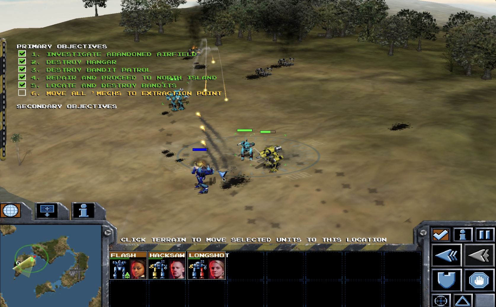
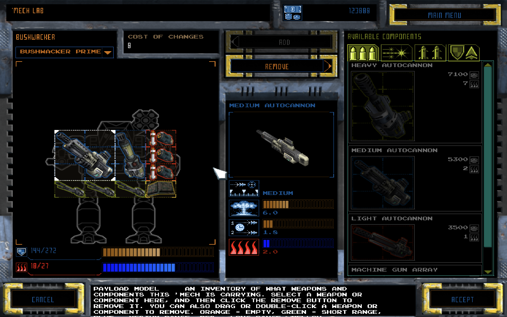

# MechCommander 2 for macOS (Apple Silicon)

A native arm64 port of MechCommander 2: the open-source
[alariq/mc2](https://github.com/alariq/mc2) SDL/OpenGL engine built and run
on macOS, with this machine's changes carried as
[`native/macos.patch`](native/macos.patch). The port uses SDL2/OpenGL input
and rendering, bypassing the original DirectDraw/Win32 input path entirely.

## Screenshots





Gameplay video: [docs/screenshots/gameplay.mp4](docs/screenshots/gameplay.mp4)

## Quick start

```sh
git submodule update --init
make deps      # Homebrew build dependencies (see below)
make native
make run
```

Requires CMake, git, make, and ffmpeg, plus the Homebrew formulas
`sdl2-compat`, `sdl2_mixer`, `sdl2_ttf`, and `glew` (`make deps` installs
them; the build script checks and lists anything missing; ffmpeg converts
the intro movie videos). The build script clones
[mc2srcdata](https://github.com/alariq/mc2srcdata), applies
`native/macos.patch`, builds the engine and data tools, and processes the
runtime data locally — it does not replace or redistribute Microsoft's game
assets.

Known defects and their fixes are tracked in
[docs/defects](docs/defects/README.md).

## Distributable app

```sh
make dist
```

Produces `dist/MechCommander2.app` (plus a shareable zip of the same). All
Homebrew libraries — including the SDL3 library that Homebrew's SDL2-compat
shim loads at runtime — are bundled into the app bundle and ad-hoc signed,
so it runs on Apple Silicon Macs without Homebrew. Game data is not
included: on first launch the app downloads it from the
[alariq/mc2 GitHub release](https://github.com/alariq/mc2/releases) (URL in
`Contents/Resources/data-url.txt`, overridable with `MC2_DATA_URL`) into
`~/Library/Application Support/MechCommander2/`. The build also emits
`dist/mc2-data.tar.gz`, a processed data archive for hosting your own
download (`SKIP_DATA_ARCHIVE=1` skips it).

## Repository layout

- `native/mc2` — upstream engine submodule; macOS changes live in the patch,
  not in the submodule (pinned to the commit the patch applies to)
- `native/macos.patch` — input, cursor, HiDPI, movie, and resolution fixes
- `native/icon/` — app icon sources (`AppIcon.iconset`)
- `Makefile` — convenience targets (`make help`) delegating to `scripts/`
- `scripts/build-native-macos.sh` / `scripts/run-native-macos.sh` — build and
  launch
- `scripts/build-dist-macos.sh` — bundle the relocatable `.app` and data
  archive
- `docs/defects/` — tracked bugs and their fixes
  ([index](docs/defects/README.md))

## Legal

Use game files you are entitled to use. Keep the original game data local;
the open-source engine does not grant redistribution rights to Microsoft's
game assets.

## Sources

- Native engine build notes:
  <https://github.com/kevinctracy/mc2/blob/master/BUILD-MAC.md>
